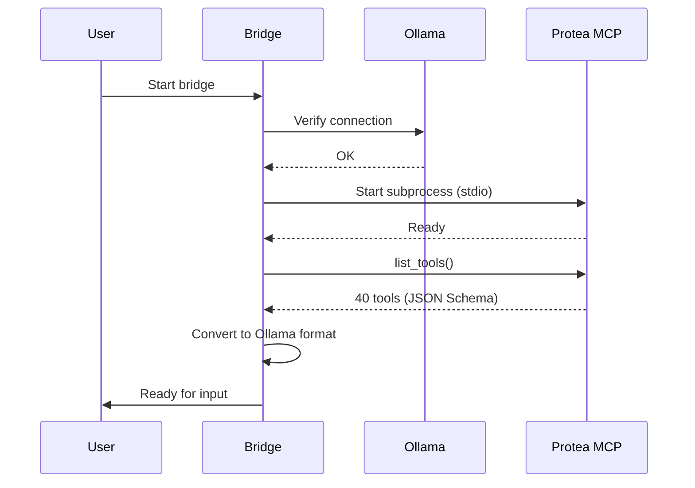
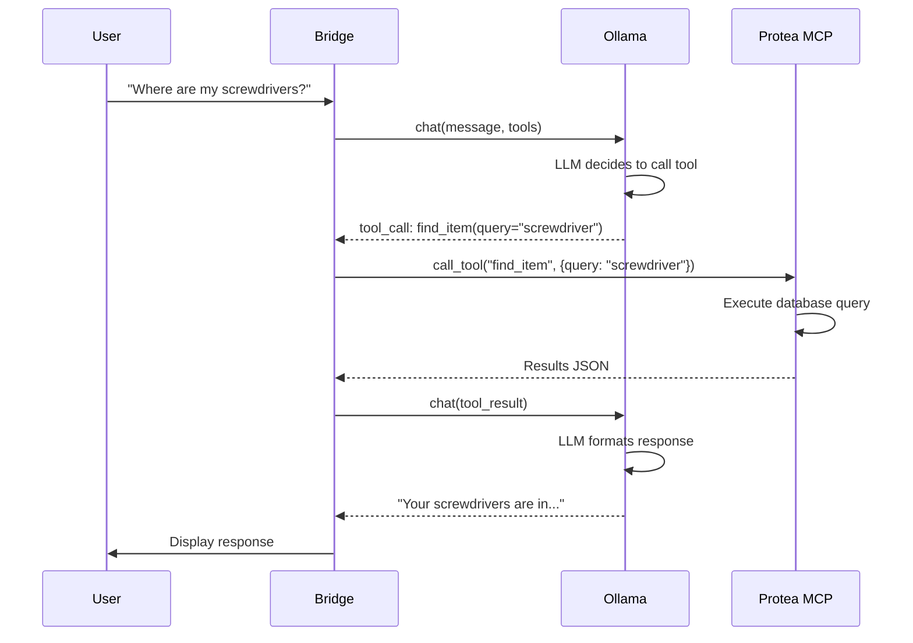
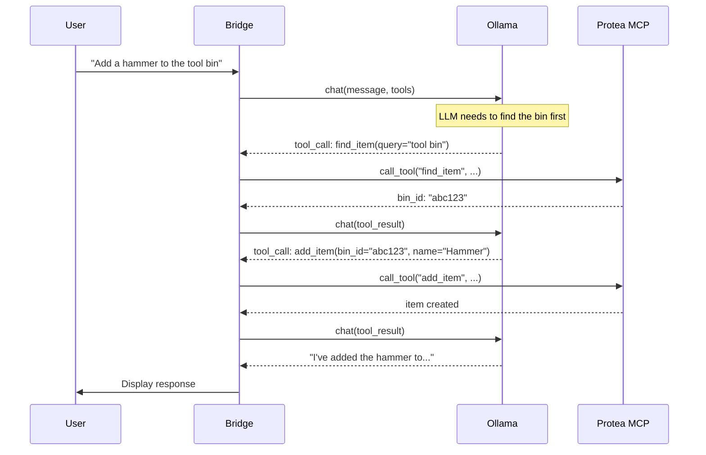

# Local LLM Setup with Ollama

This guide explains how to use a local LLM (via Ollama) with Protea's MCP tools instead of Claude Desktop.

## How the Connection Works

```
┌─────────────────────────────────────────────────────────────────────────┐
│                        Ollama-MCP Bridge                                │
│                                                                         │
│  ┌─────────┐    ┌──────────────────┐    ┌─────────────────────────┐   │
│  │  User   │───>│  Bridge Script   │───>│  Ollama API             │   │
│  │ (CLI)   │<───│  (Python)        │<───│  (http://server:11434)  │   │
│  └─────────┘    └────────┬─────────┘    └───────────┬─────────────┘   │
│                          │                          │                  │
│                          │                          ▼                  │
│                          │               ┌─────────────────────────┐   │
│                          │               │  Local LLM              │   │
│                          │               │  (llama3.1, qwen2.5,    │   │
│                          │               │   mistral, etc.)        │   │
│                          │               └─────────────────────────┘   │
│                          │                                             │
│                          ▼                                             │
│               ┌─────────────────────────┐                             │
│               │  MCP Client             │                             │
│               │  (stdio transport)      │                             │
│               └───────────┬─────────────┘                             │
│                           │                                            │
└───────────────────────────┼────────────────────────────────────────────┘
                            │
                            │ stdin/stdout
                            ▼
               ┌─────────────────────────┐
               │  Protea MCP Server      │
               │  (protea command)       │
               └───────────┬─────────────┘
                           │
                           ▼
               ┌─────────────────────────┐
               │  SQLite Database        │
               │  + Image Storage        │
               └─────────────────────────┘
```

## Communication Flow

### Step 1: Initialization



### Step 2: User Query with Tool Calls



### Step 3: Multi-Tool Conversation



## Tool Format Conversion

The bridge converts MCP tool definitions to Ollama's format:

### MCP Format (JSON Schema)
```json
{
  "name": "search_items",
  "description": "Search inventory by name, description, or alias",
  "inputSchema": {
    "type": "object",
    "properties": {
      "query": {
        "type": "string",
        "description": "Search query"
      },
      "location_id": {
        "type": "string",
        "description": "Filter by location"
      }
    },
    "required": ["query"]
  }
}
```

### Ollama Format
```json
{
  "type": "function",
  "function": {
    "name": "search_items",
    "description": "Search inventory by name, description, or alias",
    "parameters": {
      "type": "object",
      "properties": {
        "query": {
          "type": "string",
          "description": "Search query"
        },
        "location_id": {
          "type": "string",
          "description": "Filter by location"
        }
      },
      "required": ["query"]
    }
  }
}
```

The conversion is straightforward since both use JSON Schema for parameters.

---

## Setup Instructions

### Prerequisites

1. **Ollama installed and running** on your GPU server
2. **Protea installed** with MCP server available
3. **Python 3.11+** with pip

### Step 1: Install Ollama (on GPU server)

```bash
# On your AMD 7900 XTX / Strix server
curl -fsSL https://ollama.com/install.sh | sh

# Start Ollama (if not running as service)
ollama serve

# Pull a model with good tool support
ollama pull llama3.1:70b  # Best for your 128GB RAM
# or smaller options:
ollama pull llama3.1:8b
ollama pull qwen2.5:32b
ollama pull mistral-nemo:12b
```

### Step 2: Configure Ollama for Remote Access

By default, Ollama only listens on localhost. To allow remote connections:

```bash
# Option A: Environment variable
export OLLAMA_HOST=0.0.0.0:11434
ollama serve

# Option B: Systemd service (persistent)
sudo systemctl edit ollama
```

Add:
```ini
[Service]
Environment="OLLAMA_HOST=0.0.0.0:11434"
```

Then:
```bash
sudo systemctl restart ollama
```

### Step 3: Install Bridge Dependencies

```bash
cd /path/to/protea

# Install protea (if not already)
pip install -e .

# Install ollama Python client
pip install ollama
```

### Step 4: Get API Key

1. Start Protea web UI: `protea-web`
2. Go to http://localhost:8080/settings
3. Create an API key
4. Copy the key

### Step 5: Run the Bridge

```bash
# Set API key
export PROTEA_API_KEY="your-api-key-here"

# Run with defaults (localhost Ollama, llama3.1:8b)
python tools/ollama_mcp_bridge.py

# Run with remote Ollama and larger model
python tools/ollama_mcp_bridge.py \
  --model llama3.1:70b \
  --ollama-url http://gpu-server:11434

# Run with verbose output to see tool details
python tools/ollama_mcp_bridge.py -v
```

---

## Recommended Models

For reliable tool/function calling, use models specifically trained for it:

| Model | Size | VRAM | Tool Quality | Notes |
|-------|------|------|--------------|-------|
| `llama3.1:70b` | 70B | ~40GB | Excellent | Best overall |
| `llama3.1:8b` | 8B | ~5GB | Good | Fast, good for testing |
| `qwen2.5:72b` | 72B | ~45GB | Excellent | Great reasoning |
| `qwen2.5:32b` | 32B | ~20GB | Very Good | Good balance |
| `mistral-nemo:12b` | 12B | ~8GB | Good | Fast responses |
| `command-r:35b` | 35B | ~22GB | Good | Cohere's model |

With **128GB system RAM**, Ollama can offload model layers to RAM if GPU VRAM is insufficient. The 70B models will work but may be slower.

### AMD GPU Considerations

For your AMD Radeon (ROCm):
- Ollama supports ROCm for AMD GPUs
- Install ROCm 5.7+ for best compatibility
- Set `HSA_OVERRIDE_GFX_VERSION=11.0.0` if using newer AMD cards

```bash
# Check ROCm is working
rocminfo

# If needed, set GFX version override
export HSA_OVERRIDE_GFX_VERSION=11.0.0
ollama serve
```

---

## Example Session

```
============================================================
Protea Inventory Assistant (powered by Ollama)
============================================================
Model: llama3.1:70b
Ollama: http://gpu-server:11434

Commands:
  /clear  - Clear conversation history
  /tools  - List available tools
  /quit   - Exit
============================================================

You: Where are my Phillips screwdrivers?

[Calling 1 tool(s)...]
  -> find_item({"query": "Phillips screwdriver"})

Assistant: I found 3 Phillips screwdrivers in your inventory:

1. **Phillips Screwdriver #2** - Garage > Workbench > Tool Drawer
2. **Phillips Screwdriver #1** - Garage > Workbench > Tool Drawer  
3. **Phillips Screwdriver Set** - Workshop > Cabinet A > Drawer 3

You: Add a claw hammer to my tool drawer

[Calling 2 tool(s)...]
  -> get_bin_by_path({"path": "Garage/Workbench/Tool Drawer"})
  -> add_item({"bin_id": "...", "name": "Claw Hammer"})

Assistant: Done\! I added a Claw Hammer to Garage > Workbench > Tool Drawer.
```

---

## Troubleshooting

### "Model not found"
Pull the model first: `ollama pull llama3.1:8b`

### "Connection refused" to Ollama
- Check Ollama is running: `systemctl status ollama`
- Check it is listening on the right interface: `OLLAMA_HOST=0.0.0.0:11434`

### Tool calls not working
- Use a model with tool support (llama3.1, qwen2.5, mistral-nemo)
- Smaller models may hallucinate tool names

### MCP authentication failed
- Set PROTEA_API_KEY environment variable
- Get a key from the web UI at /settings

---

## Limitations vs Claude Desktop

| Feature | Claude Desktop | Ollama Bridge |
|---------|---------------|---------------|
| Tool calling | Excellent | Good (model dependent) |
| Reasoning | Excellent | Good-Very Good |
| Vision/Images | Yes | Not yet |
| Context length | 200K | 8K-128K (model dependent) |
| Speed | Fast | Varies by hardware |
| Cost | API fees | Free (local) |
| Privacy | Cloud | 100% local |

## Future Improvements

- [ ] Vision support via llava models
- [ ] Streaming responses
- [ ] Web UI interface
- [ ] Multi-turn conversation memory
- [ ] Model auto-selection based on query complexity
