# Protea Architecture Diagram

## High-Level System Architecture

```mermaid
flowchart TB
    subgraph Clients["Client Interfaces"]
        phone["📱 Mobile Phone<br/>(Camera/Browser)"]
        desktop["🖥️ Claude Desktop<br/>(MCP Client)"]
        browser["🌐 Web Browser"]
    end

    subgraph WebLayer["Web Layer (Port 8080)"]
        fastapi["FastAPI Web App"]
        templates["Jinja2 Templates<br/>+ HTMX"]
        auth_web["Session Auth<br/>(Cookies)"]
    end

    subgraph MCPLayer["MCP Layer"]
        mcp_stdio["MCP Server<br/>(stdio transport)"]
        mcp_sse["MCP-SSE Bridge<br/>(Port 8081)"]
        auth_api["API Key Auth"]
    end

    subgraph Services["Services Layer"]
        image_store["Image Store<br/>(WebP Processing)"]
        vision["Vision Service<br/>(Claude API)"]
        embedding["Embedding Service<br/>(Sentence Transformers)"]
    end

    subgraph Tools["MCP Tools (~40 tools)"]
        location_tools["Location Tools"]
        bin_tools["Bin Tools"]
        item_tools["Item Tools"]
        search_tools["Search Tools"]
        session_tools["Session Tools"]
        vision_tools["Vision Tools"]
    end

    subgraph Data["Data Layer"]
        sqlite[("SQLite DB<br/>WAL Mode + FTS5")]
        images[("Image Storage<br/>/data/images")]
    end

    phone --> browser
    phone --> mcp_sse
    browser --> fastapi
    desktop --> mcp_stdio

    fastapi --> auth_web
    fastapi --> templates
    fastapi --> Tools

    mcp_stdio --> auth_api
    mcp_sse --> auth_api
    mcp_stdio --> Tools
    mcp_sse --> mcp_stdio

    Tools --> Services
    Tools --> sqlite

    image_store --> images
    vision --> image_store
    embedding --> sqlite
```

## Component Descriptions

### Client Interfaces
| Component | Purpose |
|-----------|---------|
| **Mobile Phone** | Take photos of bins, upload via web or SSE |
| **Claude Desktop** | AI-powered cataloging via MCP protocol |
| **Web Browser** | Search, browse, manage inventory |

### Web Layer (FastAPI)
- **Port 8080** - Primary web interface
- **Jinja2 + HTMX** - Server-rendered UI with dynamic updates
- **Session Auth** - Cookie-based authentication with CSRF protection

### MCP Layer
- **stdio transport** - Direct connection from Claude Desktop
- **SSE Bridge (8081)** - HTTP-based MCP for remote/mobile clients
- **API Key Auth** - Bearer token authentication for MCP clients

### Services
| Service | Responsibility |
|---------|----------------|
| **Image Store** | Validate, convert to WebP, generate thumbnails |
| **Vision Service** | Call Claude API to extract items from photos |
| **Embedding Service** | Generate vectors for semantic search |

### Data Layer
- **SQLite** with WAL mode for concurrent access
- **FTS5** for full-text search
- **13 tables** including locations, bins, items, sessions
- **Image storage** organized by bins and sessions

---

## Data Flow Diagram

```mermaid
flowchart LR
    subgraph Input["Input Sources"]
        photo["📷 Photos"]
        manual["⌨️ Manual Entry"]
        barcode["📊 Barcode Scan"]
    end

    subgraph Processing["Processing"]
        session["Session<br/>(Batch Work)"]
        vision["Vision<br/>Extraction"]
        validation["Validation"]
    end

    subgraph Storage["Storage"]
        pending["Pending Items"]
        committed["Committed Items"]
        activity["Activity Log"]
    end

    subgraph Output["Retrieval"]
        search["Search<br/>(FTS + Vector)"]
        browse["Browse<br/>(Hierarchy)"]
        history["History<br/>(Audit Trail)"]
    end

    photo --> session
    manual --> validation
    barcode --> validation

    session --> vision
    vision --> pending
    pending -->|"commit"| committed
    validation --> committed

    committed --> activity
    committed --> search
    committed --> browse
    activity --> history
```

---

## Deployment Architecture

