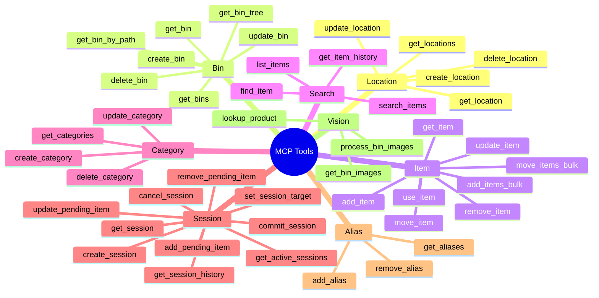
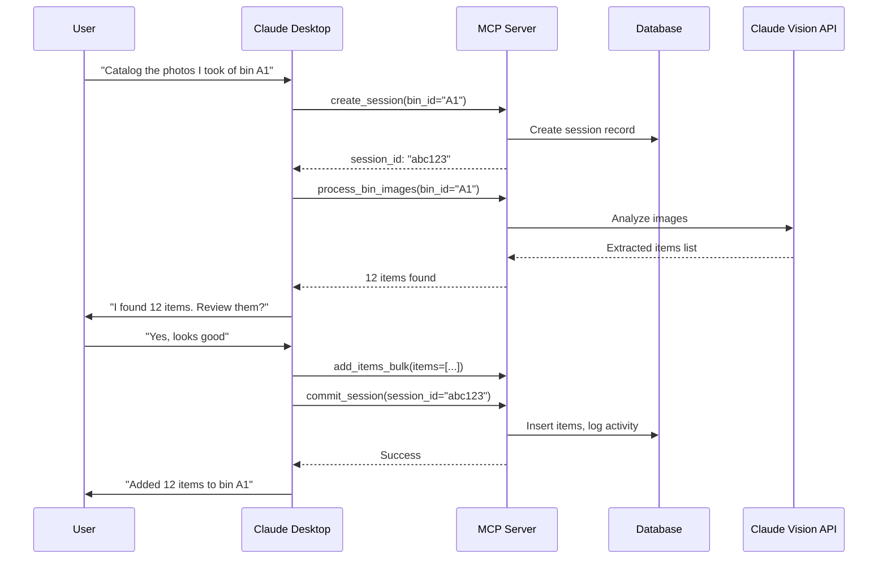

# MCP Tools Overview

Protea exposes approximately **40 MCP tools** organized into functional categories. These tools enable Claude Desktop (or any MCP client) to fully manage your inventory through natural conversation.

## Tools by Category



---

## Tool Categories Detail

### 1. Location Tools (5 tools)
Manage physical locations (rooms, areas, buildings).

| Tool | Purpose | Example Use |
|------|---------|-------------|
| `get_locations` | List all locations | "Show me all my storage areas" |
| `get_location` | Get location details | "What's in the garage?" |
| `create_location` | Add new location | "Add a new location called workshop" |
| `update_location` | Modify location | "Rename garage to main garage" |
| `delete_location` | Remove location | "Delete the old storage room" |

### 2. Bin Tools (7 tools)
Manage containers with support for hierarchical nesting.

| Tool | Purpose | Example Use |
|------|---------|-------------|
| `get_bins` | List bins (optional filter) | "List all bins in the garage" |
| `get_bin` | Get bin with contents | "What's in bin A1?" |
| `get_bin_by_path` | Find bin by path | "Find Garage > Shelf 1 > Drawer 2" |
| `get_bin_tree` | Hierarchical view | "Show me the bin structure" |
| `create_bin` | Add new bin | "Create a bin called 'Electronics'" |
| `update_bin` | Modify bin | "Move this bin to shelf 2" |
| `delete_bin` | Remove bin | "Delete empty bin C3" |

### 3. Item Tools (7 tools)
Core inventory management for individual items.

| Tool | Purpose | Example Use |
|------|---------|-------------|
| `add_item` | Create new item | "Add 5 AA batteries to bin A1" |
| `get_item` | Get item details | "Show me details for item #42" |
| `update_item` | Modify item | "Update the description for that resistor" |
| `remove_item` | Delete item | "Remove the broken cable" |
| `use_item` | Decrement quantity | "I used 2 screws from bin B3" |
| `move_item` | Relocate item | "Move the multimeter to workbench bin" |
| `move_items_bulk` | Move multiple items | "Move all electronics to new bin" |
| `add_items_bulk` | Add multiple items | "Add these 10 extracted items" |

### 4. Search Tools (4 tools)
Find items using various search methods.

| Tool | Purpose | Example Use |
|------|---------|-------------|
| `search_items` | Full-text + vector search | "Find anything related to soldering" |
| `find_item` | Locate specific item | "Where are my Phillips screwdrivers?" |
| `list_items` | Browse with filters | "List all items in category 'Tools'" |
| `get_item_history` | Audit trail | "Show history for the power drill" |

### 5. Category Tools (4 tools)
Organize items with hierarchical categories.

| Tool | Purpose | Example Use |
|------|---------|-------------|
| `get_categories` | List all categories | "Show me all categories" |
| `create_category` | Add new category | "Create 'Arduino Parts' under Electronics" |
| `update_category` | Modify category | "Rename 'Misc' to 'Miscellaneous'" |
| `delete_category` | Remove category | "Delete unused category" |

### 6. Session Tools (9 tools)
Batch processing workflow for cataloging multiple items.

| Tool | Purpose | Example Use |
|------|---------|-------------|
| `create_session` | Start new session | "Start cataloging session for bin A1" |
| `get_session` | Get session details | "Show current session status" |
| `get_active_sessions` | List open sessions | "Any sessions still open?" |
| `add_pending_item` | Queue item for commit | "Add extracted item to session" |
| `update_pending_item` | Modify pending item | "Change quantity to 5" |
| `remove_pending_item` | Remove from queue | "Remove that duplicate" |
| `set_session_target` | Change target bin | "Target these items to bin B2" |
| `commit_session` | Save all pending items | "Commit all items to inventory" |
| `cancel_session` | Discard session | "Cancel this session" |
| `get_session_history` | Past sessions | "Show completed sessions" |

### 7. Alias Tools (3 tools)
Add alternative names for better search.

| Tool | Purpose | Example Use |
|------|---------|-------------|
| `add_alias` | Add search alias | "Also call this 'flathead' screwdriver" |
| `get_aliases` | List aliases | "What aliases exist for this item?" |
| `remove_alias` | Delete alias | "Remove that alias" |

### 8. Vision Tools (3 tools)
AI-powered image analysis for item extraction.

| Tool | Purpose | Example Use |
|------|---------|-------------|
| `process_bin_images` | Extract items from photos | "Analyze these bin photos" |
| `get_bin_images` | Retrieve bin images | "Show me photos of bin A1" |
| `lookup_product` | Barcode/product lookup | "Look up this UPC code" |

---

## Tool Interaction Flow



---

## Authentication

MCP tools require authentication via API key:

```
Authorization: Bearer <api_key>
```

API keys are managed through the web UI settings page or created during initial setup.
