# Use Case 1: Import Items

## Overview
Import items into inventory using phone photos and AI-powered cataloging.

## Workflow Summary

```mermaid
flowchart LR
    A["📱 Phone:<br/>Create Bins &<br/>Take Photos"] --> B["🌐 Web App:<br/>Download<br/>Photos"]
    B --> C["🖥️ Claude Desktop:<br/>Import & Catalog"]
    C --> D["💬 Interact to<br/>Correct Items"]
    D --> E["✅ Items in<br/>Inventory"]
```



---

## Step-by-Step Workflow

### Step 1: Phone - Create Bins and Take Pictures

**Goal:** Document bin contents with photos

```mermaid
flowchart TB
    subgraph Phone["📱 Phone Actions"]
        p1["Open camera app"]
        p2["Take photo of bin label/QR"]
        p3["Take photo of bin contents"]
        p4["Repeat for each bin"]
        p5["Photos saved to camera roll"]
    end

    p1 --> p2 --> p3 --> p4 --> p5
```



**Screenshots Needed:**
1. Phone camera viewfinder showing bin
2. Photo of bin with label visible
3. Photo of bin contents (items clearly visible)
4. Camera roll showing multiple bin photos

**Tips:**
- Good lighting improves AI recognition
- Include bin label in frame for reference
- Take multiple angles for bins with many items
- Name photos with bin identifier if possible

---

### Step 2: Web App - Download Pictures

**Goal:** Transfer photos from phone to computer

```mermaid
flowchart TB
    subgraph Transfer["📲 Photo Transfer Options"]
        t1["Option A: Cloud Sync<br/>(iCloud, Google Photos)"]
        t2["Option B: Direct USB Transfer"]
        t3["Option C: AirDrop/Nearby Share"]
        t4["Option D: Email to Self"]
    end

    subgraph Result["📁 Local Folder"]
        r1["bin-a1-photo1.jpg"]
        r2["bin-a1-photo2.jpg"]
        r3["bin-b2-photo1.jpg"]
    end

    t1 --> Result
    t2 --> Result
    t3 --> Result
    t4 --> Result
```



**Screenshots Needed:**
1. Phone showing photo sharing options
2. Computer file browser with downloaded photos
3. Photos organized in folder (optional: by bin)

---

### Step 3: Claude Desktop - Import and Catalog

**Goal:** Use Claude to extract items from photos

#### 3a. Start Cataloging Session


**Claude Tool Calls:**
```json
// Tool: get_bin_by_path
{ "path": "Garage > Shelf 1 > A1" }

// Tool: create_session
{ "bin_id": 42, "name": "Cataloging bin A1" }
```

#### 3b. Process Photos


**Claude Tool Calls:**
```json
// Tool: process_bin_images
{
  "bin_id": 42,
  "images": ["base64_image_data..."]
}

// Response includes extracted items:
{
  "items": [
    { "name": "Phillips Screwdriver #2", "quantity": 1, "category": "Tools" },
    { "name": "Flathead Screwdriver", "quantity": 2, "category": "Tools" },
    { "name": "Wire Cutters", "quantity": 1, "category": "Tools" },
    { "name": "Electrical Tape (black)", "quantity": 3, "category": "Supplies" }
  ]
}
```

**Screenshots Needed:**
1. Claude Desktop showing photo attachment
2. Claude processing/analyzing message
3. Claude displaying extracted items list

---

### Step 4: Interact to Correct Items

**Goal:** Review and correct AI-extracted items

```mermaid
sequenceDiagram
    participant User
    participant Claude as Claude Desktop
    participant MCP as Protea MCP

    Claude->>User: "I found these items:<br/>1. Phillips Screwdriver #2 (qty: 1)<br/>2. Flathead Screwdriver (qty: 2)<br/>..."

    User->>Claude: "The flathead is actually a Robertson, and there's only 1"
    Claude->>MCP: update_pending_item(item_id=2, name="Robertson Screwdriver", quantity=1)
    MCP-->>Claude: Updated

    User->>Claude: "Also add a tape measure I see in the corner"
    Claude->>MCP: add_pending_item(session_id="sess_abc123", name="Tape Measure 25ft", quantity=1)
    MCP-->>Claude: Added

    User->>Claude: "Looks good, save these"
    Claude->>MCP: commit_session(session_id="sess_abc123")
    MCP-->>Claude: 9 items committed

    Claude->>User: "✓ Added 9 items to bin A1"
```



**Common Corrections:**
| Issue | User Says | Claude Action |
|-------|-----------|---------------|
| Wrong name | "That's a Robertson, not flathead" | `update_pending_item` |
| Wrong quantity | "There are 5, not 3" | `update_pending_item` |
| Missed item | "Also add the tape measure" | `add_pending_item` |
| False positive | "Remove #4, that's not an item" | `remove_pending_item` |
| Wrong category | "That should be under 'Hardware'" | `update_pending_item` |

**Claude Tool Calls:**
```json
// Tool: update_pending_item
{ "item_id": 2, "name": "Robertson Screwdriver", "quantity": 1 }

// Tool: add_pending_item
{
  "session_id": "sess_abc123",
  "name": "Tape Measure 25ft",
  "quantity": 1,
  "category": "Tools"
}

// Tool: remove_pending_item
{ "item_id": 4 }

// Tool: commit_session
{ "session_id": "sess_abc123" }
```

**Screenshots Needed:**
1. Claude showing extracted items for review
2. User conversation correcting an item
3. Claude confirming the correction
4. Final commit confirmation message

---

## Complete Workflow Diagram


---

## Example Conversation

```
User: I just photographed bin A1 in my garage. Help me catalog it.

Claude: I'll help you catalog bin A1. Let me start a session for that bin.
        [calls get_bin_by_path, create_session]
        Session started! Please share your photos of bin A1.

User: [attaches 3 photos]

Claude: Analyzing your photos...
        [calls process_bin_images]

        I found 8 items in your bin:
        1. Phillips Screwdriver #2 (qty: 1)
        2. Flathead Screwdriver (qty: 2)
        3. Needle-nose Pliers (qty: 1)
        4. Wire Strippers (qty: 1)
        5. Electrical Tape, black (qty: 3)
        6. Voltage Tester (qty: 1)
        7. Cable Ties, assorted (qty: ~50)
        8. Wire Nuts, assorted (qty: ~30)

        Do these look correct? Let me know any corrections.

User: #2 is actually just one flathead, and add a utility knife I see

Claude: Got it, updating the list.
        [calls update_pending_item, add_pending_item]

        Updated:
        - Flathead Screwdriver: qty 2 → 1
        - Added: Utility Knife (qty: 1)

        Ready to save these 9 items to bin A1?

User: Yes, save them

Claude: [calls commit_session]

        ✓ Successfully added 9 items to Garage > Shelf 1 > A1

        You can view them in the web app or ask me to find them anytime.
```
