# Use Case 2: Find Items

## Overview
Quickly locate items in your inventory using phone or web-based search.

## Workflow Summary

```mermaid
flowchart LR
    A["📱 Phone or<br/>🌐 Web Browser"] --> B["🔍 Enter<br/>Search Query"]
    B --> C["📋 Results with<br/>Location"]
    C --> D["📍 Navigate to<br/>Physical Location"]
```



---

## Search Methods

### Option A: Web Browser Search


**Screenshots Needed:**
1. Web app home page with search box
2. Search results showing items with bin/location paths
3. Item detail page with full location breadcrumb

### Option B: Phone Browser Search

```mermaid
flowchart TB
    subgraph Phone["📱 Mobile Search"]
        p1["Open browser on phone"]
        p2["Navigate to protea URL"]
        p3["Search from home page"]
        p4["Tap result for location"]
    end

    p1 --> p2 --> p3 --> p4
```



**Screenshots Needed:**
1. Mobile browser showing protea home page
2. Mobile search results
3. Mobile item detail with location

---

## Search Features

### Full-Text Search (FTS5)
Searches item names, descriptions, and aliases.

```
Query: "screwdriver"
Results: Phillips Screwdriver, Flathead Screwdriver, Robertson Screwdriver
```

### Fuzzy Matching
Handles typos and partial matches.

```
Query: "scredrivr" → matches "screwdriver"
Query: "tape" → matches "Electrical Tape", "Masking Tape", "Tape Measure"
```

### Semantic Search (Vector Embeddings)
Finds conceptually related items.

```
Query: "something to cut wires"
Results: Wire Cutters, Wire Strippers, Diagonal Pliers
```

### Category Filtering
Narrow results by category.

```
Query: "Phillips" + Category: "Tools"
Results: Phillips Screwdriver #1, Phillips Screwdriver #2
(excludes "Phillips head screws" from Hardware category)
```

---

## Search Results Format

### Web UI Results

```
┌─────────────────────────────────────────────────────────┐
│ 🔍 Search: "multimeter"                                 │
├─────────────────────────────────────────────────────────┤
│                                                         │
│  📦 Digital Multimeter (Fluke 117)                      │
│     📍 Garage > Workbench > Drawer 2                   │
│     Qty: 1 | Category: Test Equipment                   │
│                                                         │
│  📦 Multimeter Test Leads                              │
│     📍 Garage > Workbench > Drawer 2                   │
│     Qty: 2 pairs | Category: Test Equipment             │
│                                                         │
│  📦 Multimeter Fuses                                   │
│     📍 Garage > Parts Cabinet > E3                     │
│     Qty: ~10 | Category: Supplies                       │
│                                                         │
└─────────────────────────────────────────────────────────┘
```

### Location Path
Results show full hierarchical path:
- **Location** → **Bin** → **Sub-bin** (if nested)

Example paths:
- `Garage > Shelf 1 > Bin A1`
- `Workshop > Tool Wall > Pegboard Section 3`
- `Office > Desk > Top Drawer`

---

## Web UI Search Flow


---

## Example Searches

### Finding a Specific Tool

**User searches:** "Phillips screwdriver"

**Results:**
| Item | Location | Qty |
|------|----------|-----|
| Phillips Screwdriver #2 | Garage > Workbench > Drawer 1 | 1 |
| Phillips Screwdriver #1 | Garage > Workbench > Drawer 1 | 2 |
| Phillips Screwdriver Set | Workshop > Tool Cabinet > A2 | 1 set |

### Finding Related Items

**User searches:** "soldering"

**Results:**
| Item | Location | Qty |
|------|----------|-----|
| Soldering Iron | Garage > Electronics Bench > Bin E1 | 1 |
| Solder Wire (60/40) | Garage > Electronics Bench > Bin E1 | 1 roll |
| Soldering Iron Tips | Garage > Electronics Bench > Bin E1 | 5 |
| Flux Paste | Garage > Electronics Bench > Bin E2 | 1 jar |
| Desoldering Pump | Garage > Electronics Bench > Bin E1 | 1 |

### Finding by Description

**User searches:** "something to measure voltage"

**Semantic search results:**
| Item | Location | Qty |
|------|----------|-----|
| Digital Multimeter | Garage > Workbench > Drawer 2 | 1 |
| Voltage Tester Pen | Garage > Workbench > Drawer 2 | 1 |
| Clamp Meter | Workshop > Tool Cabinet > B3 | 1 |

---

## Screenshots Checklist

### Web Browser Flow
1. **Home page** - Clean search box (Google-style)
2. **Typing query** - Search box with partial query
3. **Results list** - Multiple results with location paths
4. **Item detail** - Full item info with breadcrumb location
5. **Empty results** - "No items found" state

### Mobile Browser Flow
1. **Mobile home** - Responsive search interface
2. **Mobile results** - Compact result cards
3. **Mobile detail** - Item detail on small screen

---

## Pro Tips for Searching

| Tip | Example |
|-----|---------|
| Use aliases | Search "flathead" finds "Slotted Screwdriver" |
| Try semantic queries | "cut metal" finds "Tin Snips", "Hacksaw" |
| Browse by location | Click location links to see nearby items |
| Check history | Recent activity shows what you last accessed |
