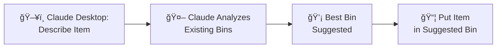
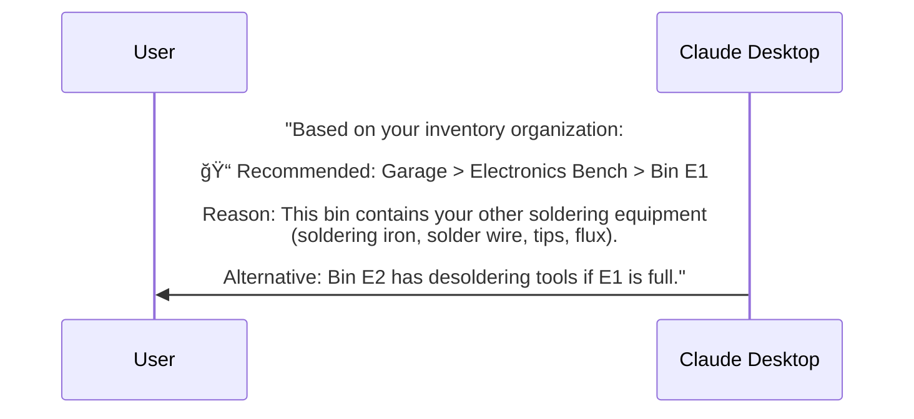
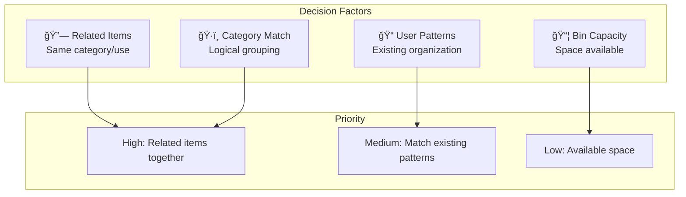

# Use Case 3: Where to Put Item

## Overview
Ask Claude where to store a new item based on existing inventory organization.

## Workflow Summary



---

## Workflow Detail

### Step 1: Describe Item to Claude

User describes the item they want to store, including relevant details.


**What to include:**
- Item name/type
- Category hint (optional)
- Size considerations (optional)
- Related items (optional)

---

### Step 2: Claude Analyzes Inventory

Claude searches existing inventory to find where similar items are stored.


**Claude Tool Calls:**
```json
// Tool: search_items - Find similar items
{ "query": "soldering" }

// Tool: get_bin - Check suggested bin details
{ "bin_id": 15 }

// Tool: get_bin_tree - See organization structure
{ "location_id": 1 }
```

---

### Step 3: Claude Suggests Best Bin

Claude provides a recommendation with reasoning.



**Recommendation Factors:**
| Factor | Why It Matters |
|--------|----------------|
| Similar items | Keep related items together |
| Same category | Logical organization |
| Available space | Bin shouldn't be overfull |
| User's existing pattern | Match their organization style |

---

### Step 4: User Stores Item

User places item in suggested bin and optionally adds to inventory.


**Claude Tool Call:**
```json
// Tool: add_item
{
  "bin_id": 15,
  "name": "Soldering Iron Stand",
  "quantity": 1,
  "category": "Tools",
  "description": "Holder for soldering iron when not in use"
}
```

---

## Complete Conversation Example

```
User: I just bought a new heat gun. Where should I store it?

Claude: Let me check where you keep similar items...
        [calls search_items("heat gun"), search_items("heat shrink"),
         search_items("electronics tools")]

        Based on your current organization, I recommend:

        📠Primary: Garage > Electronics Bench > Bin E3

        Reason: This bin contains your heat shrink tubing, cable ties,
        and wire management supplies. A heat gun is commonly used with
        these items.

        📠Alternative: Garage > Power Tools > Shelf 2

        This is where you keep larger power tools (drill, sander).
        If the heat gun is large or if you think of it more as a
        power tool than an electronics tool, this could work too.

        Which would you prefer?

User: The electronics bench makes sense. Add it there.

Claude: [calls add_item]

        ✓ Added "Heat Gun" to Garage > Electronics Bench > Bin E3

        Tip: I also noticed you have heat shrink tubing in Bin E2.
        You might want to consolidate those together.

User: Good point, can you move the heat shrink to E3 too?

Claude: [calls move_items_bulk]

        ✓ Moved 3 heat shrink items from E2 to E3:
        - Heat Shrink Tubing, Assorted Sizes
        - Heat Shrink Tubing, 1/4"
        - Heat Shrink Tubing, 1/2"
```

---

## Workflow Diagram


---

## Screenshots Needed

### Claude Desktop Conversation
1. **User question** - "Where should I put this new [item]?"
2. **Claude searching** - Showing tool calls to search inventory
3. **Recommendation** - Claude's suggestion with reasoning
4. **Confirmation** - User accepts, item added

### Supporting Screenshots
5. **Web UI bin view** - Showing the suggested bin contents
6. **Physical location** - Photo of actual bin (before/after)

---

## Recommendation Logic

Claude considers these factors when suggesting bins:



---

## Edge Cases

| Scenario | Claude's Approach |
|----------|------------------|
| No similar items exist | Suggest based on category, or ask user |
| Multiple good options | Present top 2-3 with tradeoffs |
| All relevant bins full | Suggest creating new bin or reorganizing |
| Item spans categories | Ask user which use case is primary |
| First item in new location | Help set up initial organization |
