# Use Case 4: Organize Bins

## Overview
Ask Claude to help reorganize bins or sets of bins for better organization.

## Workflow Summary

```mermaid
flowchart LR
    A["🖥️ Claude Desktop:<br/>Request Organization<br/>Help"] --> B["🤖 Claude Analyzes<br/>Current State"]
    B --> C["📋 Reorganization<br/>Plan Proposed"]
    C --> D["✅ User Approves<br/>Changes"]
    D --> E["📦 Items Moved<br/>to New Locations"]
```



---

## Types of Organization Requests

### Single Bin Cleanup
"Help me organize bin A1 - it's become a junk drawer"

### Multi-Bin Consolidation
"I have electronics spread across 5 bins, can you help consolidate?"

### Category-Based Reorganization
"Reorganize my tool bins by category"

### New System Setup
"I want to set up a new storage system for my workshop"

---

## Workflow Detail

### Step 1: Request Organization Help


---

### Step 2: Claude Analyzes Current State


**Claude Tool Calls:**
```json
// Tool: get_bins - List bins to organize
{ "location_id": 5 }

// Tool: get_bin - Get contents of each bin
{ "bin_id": 20 }  // Hardware-1
{ "bin_id": 21 }  // Hardware-2
{ "bin_id": 22 }  // Hardware-3
```

---

### Step 3: Claude Proposes Reorganization Plan

```mermaid
sequenceDiagram
    participant User
    participant Claude as Claude Desktop

    Claude->>User: "I analyzed 135 items across 3 bins.<br/><br/>Current state:<br/>- Items are mixed with no clear pattern<br/>- Screws, bolts, and nails scattered everywhere<br/>- Hard to find specific sizes<br/><br/>Proposed organization:<br/><br/>📦 Bin 1: Screws (by type/size)<br/>  - Wood screws: 23 items<br/>  - Machine screws: 18 items<br/>  - Sheet metal screws: 8 items<br/><br/>📦 Bin 2: Bolts & Nuts<br/>  - Bolts: 31 items<br/>  - Nuts: 22 items<br/>  - Washers: 15 items<br/><br/>📦 Bin 3: Nails & Misc<br/>  - Nails: 12 items<br/>  - Anchors: 4 items<br/>  - Misc hardware: 2 items<br/><br/>Should I proceed with this reorganization?"
```



**Proposal includes:**
- Current state analysis
- Problems identified
- Proposed new organization
- Item counts per destination
- Request for approval

---

### Step 4: User Approves and Claude Executes


**Claude Tool Calls:**
```json
// Tool: update_bin - Rename bins for clarity
{ "bin_id": 20, "name": "Screws" }
{ "bin_id": 21, "name": "Bolts & Nuts" }
{ "bin_id": 22, "name": "Nails & Misc" }

// Tool: move_items_bulk - Move items to correct bins
{
  "item_ids": [101, 102, 103, ...],  // Screw items
  "target_bin_id": 20
}
{
  "item_ids": [151, 152, 153, ...],  // Bolt/nut items
  "target_bin_id": 21
}
{
  "item_ids": [201, 202, 203, ...],  // Nail/misc items
  "target_bin_id": 22
}
```

---

## Complete Conversation Example

```
User: My electronics bins are a mess. I have components spread across
      bins E1, E2, E3, and E4. Can you help organize them better?

Claude: Let me analyze your electronics bins...
        [calls get_bin for each bin]

        Current State Analysis:
        ━━━━━━━━━━━━━━━━━━━━━━
        📦 E1 (47 items): Mixed - resistors, capacitors, some ICs, wires
        📦 E2 (31 items): Mixed - LEDs, more resistors, connectors
        📦 E3 (28 items): Mixed - Arduino boards, sensors, random parts
        📦 E4 (15 items): Mostly empty - few transistors, some wire

        I recommend reorganizing by component type:

        📦 E1 → "Passive Components"
           Resistors (45), Capacitors (28), Inductors (3)
           Total: 76 items

        📦 E2 → "Active Components"
           ICs (12), Transistors (8), Diodes (15), LEDs (23)
           Total: 58 items

        📦 E3 → "Boards & Modules"
           Arduinos (4), Sensors (11), Displays (3), Motor drivers (2)
           Total: 20 items

        📦 E4 → "Connectors & Wire"
           Connectors (18), Headers (12), Wire spools (5), Jumpers (3)
           Total: 38 items

        This keeps similar components together and matches how you'd
        typically search for parts during a project.

        Should I proceed with this reorganization?

User: Yes, but keep the Arduino stuff in E3 since I use that bench
      for Arduino projects.

Claude: Good thinking - I'll keep the Arduinos in E3 and organize
        the rest. Proceeding...
        [calls update_bin, move_items_bulk multiple times]

        ✓ Reorganization complete!

        📦 E1 "Passive Components": 76 items
        📦 E2 "Active Components": 58 items
        📦 E3 "Boards & Modules": 20 items (Arduino items kept here)
        📦 E4 "Connectors & Wire": 38 items

        All 192 items organized. Changes logged in activity history.

User: Perfect! Can you also suggest labels for the sub-dividers
      in each bin?

Claude: Based on the quantities, here are label suggestions:

        E1 Passive Components:
        ┌─────────┬─────────┬─────────┐
        │ 1/4W    │ 1/2W    │ SMD     │ ← Resistors by type
        │ Resistor│ Resistor│ Resistor│
        ├─────────┼─────────┼─────────┤
        │ Ceramic │ Electro │ Film    │ ← Capacitors
        │ Caps    │ lytic   │ Caps    │
        └─────────┴─────────┴─────────┘

        E2 Active Components:
        ┌─────────┬─────────┬─────────┐
        │ ICs     │ Trans-  │ Diodes  │
        │ (DIP)   │ istors  │         │
        ├─────────┼─────────┼─────────┤
        │ LEDs    │ LEDs    │ Voltage │
        │ (std)   │ (RGB)   │ Regs    │
        └─────────┴─────────┴─────────┘

        Want me to add these as bin descriptions?
```

---

## Workflow Diagram


---

## Screenshots Needed

### Claude Desktop Conversation
1. **Initial request** - User asks for organization help
2. **Analysis phase** - Claude showing tool calls
3. **Current state** - Claude's analysis of existing organization
4. **Proposal** - Detailed reorganization plan
5. **User feedback** - Modification request
6. **Execution** - Claude performing moves
7. **Completion** - Final summary

### Web UI Before/After
8. **Before** - Bin view showing mixed contents
9. **After** - Same bins with organized contents
10. **Activity log** - Showing all moves recorded

---

## Organization Strategies Claude Uses


---

## Advanced Organization Features

### Creating Sub-Bins
```
User: Can you create dividers in my hardware bin?

Claude: I'll create sub-bins within Hardware-1:
        [calls create_bin with parent_bin_id]

        Created nested structure:
        📦 Hardware-1
           ├── 📦 Screws
           ├── 📦 Bolts
           ├── 📦 Nuts & Washers
           └── 📦 Anchors
```

### Suggesting New Bins
```
User: I have too many items in one bin.

Claude: Bin E1 has 89 items - that's a lot to search through.

        I recommend splitting into 2 bins:
        - E1a: Resistors (45 items)
        - E1b: Capacitors (44 items)

        Should I create the new bin and redistribute?
```

### Consolidation
```
User: I have similar items in too many places.

Claude: I found "AA Batteries" in 4 different locations:
        - Garage > Drawer 1: 8 count
        - Office > Desk: 4 count
        - Kitchen > Junk Drawer: 2 count
        - Basement > Shelf 3: 12 count

        Recommend consolidating to Garage > Drawer 1 (26 total)?
```
