# Protea Software Layer Architecture

## Complete System Layer Diagram

```mermaid
flowchart TB
    subgraph ClientLayer["CLIENT LAYER"]
        direction LR
        claude_desktop["🖥️ Claude Desktop"]
        web_browser["🌐 Web Browser"]
        mobile["📱 Mobile Device"]
        cli["⌨️ CLI / Terminal"]
    end

    subgraph AILayer["AI / LLM LAYER"]
        direction LR
        subgraph CloudAI["Cloud AI (Anthropic)"]
            claude_api["Claude API<br/><small>claude-3-5-sonnet</small>"]
            vision_api["Vision API<br/><small>Image Analysis</small>"]
        end
        subgraph LocalAI["Local AI (Self-Hosted)"]
            ollama["Ollama Server<br/><small>:11434</small>"]
            local_models["Local Models<br/><small>llama3.1 / qwen2.5 / mistral</small>"]
        end
    end

    subgraph IntegrationLayer["INTEGRATION LAYER"]
        direction LR
        subgraph MCPTransport["MCP Protocol"]
            mcp_stdio["MCP stdio<br/><small>Direct Process</small>"]
            mcp_sse["MCP-SSE Bridge<br/><small>:8081 HTTP/SSE</small>"]
        end
        subgraph Bridge["Ollama Bridge"]
            ollama_bridge["ollama_mcp_bridge.py<br/><small>Tool Converter</small>"]
        end
    end

    subgraph ApplicationLayer["APPLICATION LAYER"]
        direction LR
        subgraph WebFramework["Web Framework"]
            fastapi["FastAPI<br/><small>:8080 ASGI</small>"]
            uvicorn["Uvicorn<br/><small>ASGI Server</small>"]
        end
        subgraph UIFramework["UI Framework"]
            jinja2["Jinja2<br/><small>Templates</small>"]
            htmx["HTMX<br/><small>Dynamic Updates</small>"]
        end
        subgraph Auth["Authentication"]
            session_auth["Session Auth<br/><small>Cookies + CSRF</small>"]
            api_auth["API Key Auth<br/><small>Bearer Tokens</small>"]
        end
    end

    subgraph MCPLayer["MCP TOOLS LAYER (~40 Tools)"]
        direction LR
        subgraph CoreTools["Core Tools"]
            location_tools["Location Tools<br/><small>5 tools</small>"]
            bin_tools["Bin Tools<br/><small>7 tools</small>"]
            item_tools["Item Tools<br/><small>8 tools</small>"]
        end
        subgraph SearchTools["Search Tools"]
            search["Search/Find<br/><small>4 tools</small>"]
            category_tools["Category Tools<br/><small>4 tools</small>"]
        end
        subgraph WorkflowTools["Workflow Tools"]
            session_tools["Session Tools<br/><small>10 tools</small>"]
            vision_tools["Vision Tools<br/><small>3 tools</small>"]
            alias_tools["Alias Tools<br/><small>3 tools</small>"]
        end
    end

    subgraph ServicesLayer["SERVICES LAYER"]
        direction LR
        subgraph ImageServices["Image Processing"]
            image_store["Image Store<br/><small>Pillow/WebP</small>"]
            thumbnails["Thumbnail Gen<br/><small>Multi-size</small>"]
        end
        subgraph AIServices["AI Services"]
            vision_service["Vision Service<br/><small>Item Extraction</small>"]
            embedding_service["Embedding Service<br/><small>Sentence Transformers</small>"]
        end
        subgraph Validation["Validation"]
            pydantic["Pydantic Models<br/><small>Schema Validation</small>"]
        end
    end

    subgraph DataLayer["DATA LAYER"]
        direction LR
        subgraph Database["SQLite Database"]
            sqlite[("SQLite<br/><small>WAL Mode</small>")]
            fts5["FTS5<br/><small>Full-Text Search</small>"]
            vectors["Vector Store<br/><small>Semantic Search</small>"]
        end
        subgraph FileStorage["File Storage"]
            images[("Image Files<br/><small>/data/images</small>")]
        end
    end

    subgraph InfraLayer["INFRASTRUCTURE LAYER"]
        direction LR
        docker["Docker Compose"]
        traefik["Traefik<br/><small>Reverse Proxy</small>"]
        volumes["Persistent Volumes"]
    end

    %% Client connections
    claude_desktop --> mcp_stdio
    web_browser --> fastapi
    mobile --> fastapi
    mobile --> mcp_sse
    cli --> ollama_bridge

    %% AI Layer connections
    claude_api --> mcp_stdio
    claude_api --> mcp_sse
    ollama --> local_models
    ollama_bridge --> ollama
    ollama_bridge --> mcp_sse

    %% Integration to Application
    mcp_stdio --> MCPLayer
    mcp_sse --> MCPLayer
    fastapi --> MCPLayer

    %% Application internals
    fastapi --> uvicorn
    fastapi --> jinja2
    jinja2 --> htmx
    fastapi --> session_auth
    mcp_sse --> api_auth

    %% MCP to Services
    MCPLayer --> ServicesLayer

    %% Services to Data
    vision_service --> claude_api
    vision_service --> image_store
    embedding_service --> vectors
    image_store --> images
    pydantic --> sqlite

    %% Services to Database
    ServicesLayer --> DataLayer

    %% Infrastructure
    docker --> fastapi
    docker --> mcp_sse
    traefik --> docker
    volumes --> sqlite
    volumes --> images
```



---

## Layer Descriptions

### 1. Client Layer
| Client | Protocol | Use Case |
|--------|----------|----------|
| **Claude Desktop** | MCP stdio | AI-powered inventory management |
| **Web Browser** | HTTP/HTTPS | Search, browse, manage via UI |
| **Mobile Device** | HTTP + SSE | Photo upload, mobile search |
| **CLI/Terminal** | Ollama API + MCP | Local LLM interaction |

### 2. AI/LLM Layer

#### Cloud AI (Anthropic)
| Component | Technology | Purpose |
|-----------|------------|---------|
| **Claude API** | `anthropic>=0.40.0` | Conversation, tool calling |
| **Vision API** | Claude Vision | Image-to-text item extraction |

#### Local AI (Self-Hosted)
| Component | Technology | Purpose |
|-----------|------------|---------|
| **Ollama** | Ollama Server | Local LLM inference |
| **Local Models** | llama3.1, qwen2.5, mistral | Open-source alternatives |

### 3. Integration Layer

#### MCP Protocol
| Transport | Port | Use Case |
|-----------|------|----------|
| **stdio** | N/A | Direct Claude Desktop connection |
| **SSE** | 8081 | Remote/mobile MCP access |

#### Ollama Bridge
| Component | File | Purpose |
|-----------|------|---------|
| **Bridge Script** | `ollama_mcp_bridge.py` | Converts MCP ↔ Ollama formats |

### 4. Application Layer

#### Frameworks
| Framework | Version | Purpose |
|-----------|---------|---------|
| **FastAPI** | `>=0.109.0` | Web API + HTML serving |
| **Uvicorn** | `>=0.27.0` | ASGI server |
| **Jinja2** | `>=3.1.0` | Server-side templates |
| **HTMX** | Latest | Dynamic UI without JS |

#### Authentication
| Method | Mechanism | Scope |
|--------|-----------|-------|
| **Session Auth** | Cookies + CSRF | Web UI |
| **API Key Auth** | Bearer tokens | MCP SSE |

### 5. MCP Tools Layer (~40 Tools)

| Category | Count | Examples |
|----------|-------|----------|
| **Location** | 5 | `get_locations`, `create_location` |
| **Bin** | 7 | `get_bins`, `get_bin_tree`, `create_bin` |
| **Item** | 8 | `add_item`, `move_item`, `use_item` |
| **Search** | 4 | `search_items`, `find_item`, `list_items` |
| **Category** | 4 | `get_categories`, `create_category` |
| **Session** | 10 | `create_session`, `commit_session` |
| **Vision** | 3 | `process_bin_images`, `lookup_product` |
| **Alias** | 3 | `add_alias`, `get_aliases` |

### 6. Services Layer

| Service | Technology | Purpose |
|---------|------------|---------|
| **Image Store** | `Pillow>=10.0.0` | WebP conversion, thumbnails |
| **Vision Service** | Anthropic API | Extract items from photos |
| **Embedding Service** | `sentence-transformers>=2.2.0` | Semantic search vectors |
| **Validation** | `Pydantic>=2.0.0` | Schema validation |

### 7. Data Layer

| Component | Technology | Purpose |
|-----------|------------|---------|
| **SQLite** | WAL Mode | Concurrent read/write |
| **FTS5** | SQLite extension | Full-text search |
| **Vectors** | NumPy arrays | Semantic similarity |
| **Image Files** | WebP format | Compressed storage |

### 8. Infrastructure Layer

| Component | Technology | Purpose |
|-----------|------------|---------|
| **Docker Compose** | Multi-container | Service orchestration |
| **Traefik** | Reverse proxy | HTTPS, routing |
| **Volumes** | Docker volumes | Persistent data |

---

## Technology Stack Summary

```
┌─────────────────────────────────────────────────────────────────────┐
│                         PYTHON 3.11+                                │
├─────────────────────────────────────────────────────────────────────┤
│  AI/ML              │  Web              │  Data                     │
│  ─────────────────  │  ───────────────  │  ────────────────────     │
│  • anthropic        │  • FastAPI        │  • SQLite (WAL + FTS5)    │
│  • sentence-        │  • Uvicorn        │  • Pydantic               │
│    transformers     │  • Jinja2         │  • NumPy                  │
│  • ollama (bridge)  │  • HTMX           │  • Pillow                 │
│  • mcp              │  • bcrypt         │                           │
├─────────────────────────────────────────────────────────────────────┤
│                      INFRASTRUCTURE                                 │
│  • Docker Compose   • Traefik (reverse proxy)   • Linux/macOS       │
└─────────────────────────────────────────────────────────────────────┘
```

---

## Data Flow Comparison

### Claude Desktop Flow
```
User → Claude Desktop → stdio → MCP Server → Tools → Database
                     ↑                              ↓
                     └──────── Response ────────────┘
```

### Web Browser Flow
```
User → Browser → FastAPI → Auth → Tools → Database
              ↑                         ↓
              └──── HTML (Jinja2) ──────┘
```

### Ollama Bridge Flow
```
User → Bridge → Ollama → LLM Response
            ↘
             → MCP Client → SSE → MCP Server → Tools → Database
            ↗
       Tool Result
```

---

## Port Summary

| Port | Service | Protocol |
|------|---------|----------|
| 8080 | Web UI (FastAPI) | HTTP/HTTPS |
| 8081 | MCP-SSE Bridge | HTTP/SSE |
| 11434 | Ollama (if local) | HTTP |
